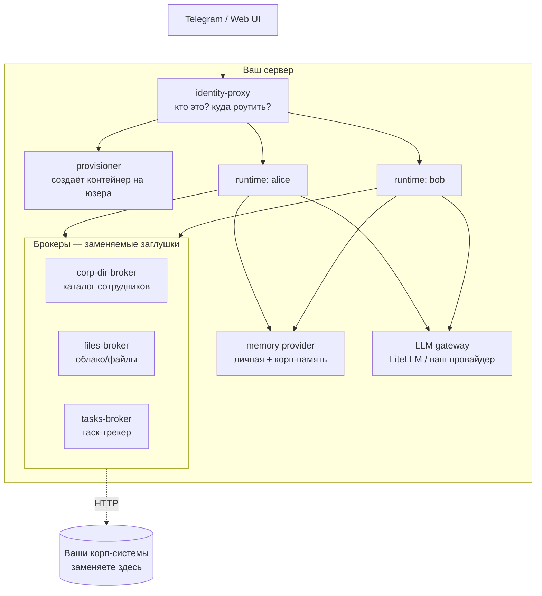
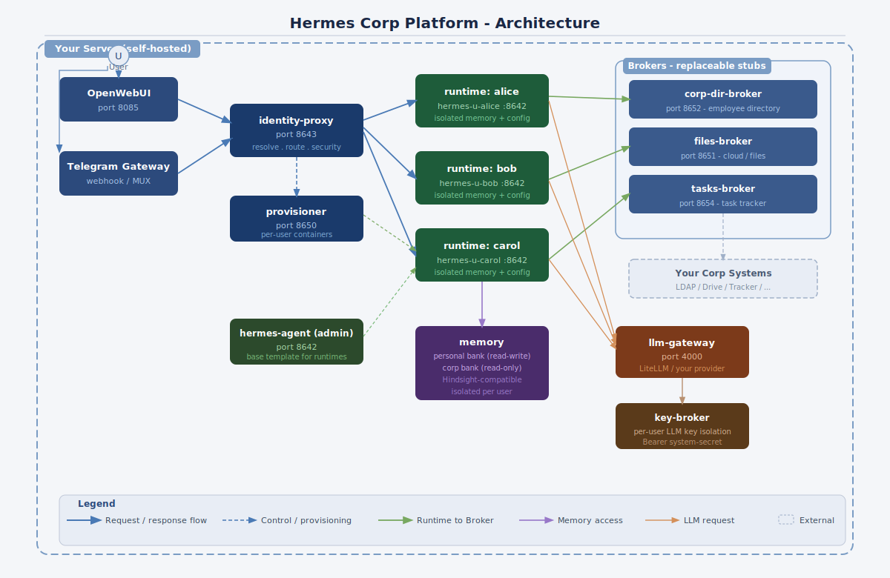
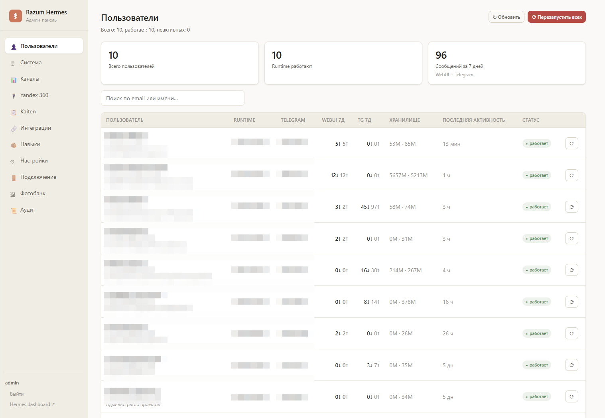
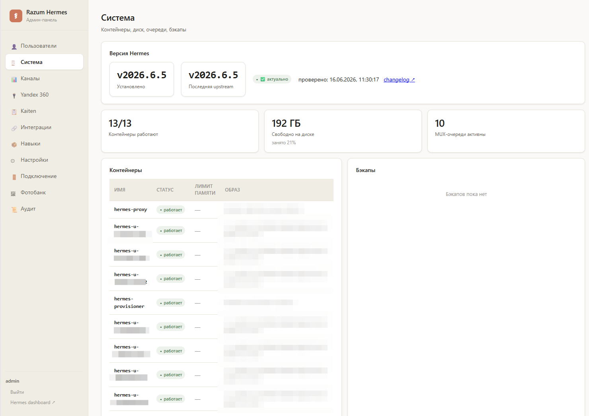
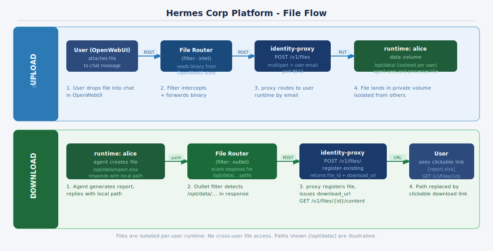

# Hermes Corp Platform

**Мультитенантная обвязка для self-hosted корпоративного ИИ-агента.** Каждому сотруднику — свой изолированный runtime с личной памятью и доступом к корпоративным системам через брокеры. Данные не уходят в чужое облако.

> Это **референс-шаблон**, а не дамп боевой системы. Всё, что касается конкретной корпоративной инфраструктуры (каталог сотрудников, облако с файлами, таск-трекер, провайдер моделей), вынесено в **заглушки** с понятным контрактом. Вы поднимаете шаблон «как есть» на моках за 10 минут, а потом по одному заменяете брокеры на свои системы.

Базовый агент — [NousResearch/Hermes-Agent](https://github.com/NousResearch). Этот репозиторий добавляет вокруг него то, чего не хватает для корпоративного развёртывания: мультитенантность, маршрутизацию по личности, изоляцию секретов и паттерн брокеров для интеграций.

---

## Зачем это нужно

«Дайте сотрудникам ChatGPT» не работает в компании, которая отвечает за персональные данные. Переписка, суммы сделок, внутренние регламенты не должны уезжать на чужие серверы и в чужое обучение. Нужен агент, который:

- живёт на вашей инфраструктуре (self-hosted);
- даёт **каждому** сотруднику отдельный изолированный контекст — память одного не видна другому;
- умеет ходить в корпоративные системы (каталог, файлы, задачи) **от имени конкретного пользователя**, а не общим супер-аккаунтом;
- отвечает на вопросы о внутренних процессах **со ссылкой на источник**, а не пересказом по памяти.

Эта обвязка решает именно это.

## Архитектура за 30 секунд





Подробно — [docs/ARCHITECTURE.md](docs/ARCHITECTURE.md).

## Интерфейс работы

Сотрудник работает через **OpenWebUI** (основной веб-интерфейс) или **Telegram**.
Оба канала ведут в `identity-proxy`: OpenWebUI пробрасывает email вошедшего
заголовком `X-OpenWebUI-User-Email`, Telegram — подписанным webhook. proxy по
этому идентификатору находит сотрудника и роутит в его персональный runtime.

Пошаговая настройка OpenWebUI (что выставить и куда вставить) —
[services/openwebui/README.md](services/openwebui/README.md).

Работа с файлами (загрузка вложений в runtime и выдача созданных агентом
файлов ссылкой) — отдельный слой: [docs/FILES.md](docs/FILES.md).

## Компоненты

| Сервис | Что делает | В шаблоне |
|---|---|---|
| [`openwebui`](services/openwebui/README.md) | Основной интерфейс пользователя. Проброс личности в proxy. | образ + конфиг |
| [`telegram-gateway`](services/telegram-gateway/README.md) | Второй канал: один бот → много пользователей (MUX), webhook. | заглушка |
| [`admin-panel`](services/admin-panel/README.md) | Веб-панель оператора: пользователи, система, каналы, аудит. | заглушка + образец |
| `identity-proxy` | Кто пришёл (Telegram ID / email) → маршрут в его runtime. Срезает секреты, ловит prompt-инъекции. | скелет с контрактом |
| `provisioner` | По контейнеру-агенту на каждого пользователя: инъекция config.yaml, режимы auth. | скелет с контрактом |
| [`key-broker`](services/key-broker/README.md) | Изоляция per-user LLM-ключей (Bearer system-secret). | заглушка + образец |
| `corp-dir-broker` | Каталог сотрудников: кто есть кто, роли, маппинг Telegram↔email. | заглушка + образец |
| `files-broker` | Файлы/календарь/почта пользователя. | заглушка + образец (Yandex 360) |
| `tasks-broker` | Задачи пользователя, статусы. | заглушка + образец (Kaiten) |
| `llm-gateway` | Единая точка к моделям. | образец (LiteLLM) |
| `memory` | Личный банк (auto-retain/recall) + корп-банк read-only. | образец (Hindsight) |
| `company/skills` | Корп-скиллы (`SKILL.md`), монтируются в runtime — кастомизация агента. | образец |

## Быстрый старт (на заглушках)

```bash
git clone https://github.com/<you>/hermes-corp-platform
cd hermes-corp-platform
cp .env.example .env        # заполнять секреты НЕ нужно — заглушки работают на моках
docker compose up -d
docker compose ps           # все сервисы healthy
curl localhost:8652/health  # пример: каталог-заглушка отвечает
```

На этом этапе у вас крутится вся топология на фейковых данных. Дальше — заменяете брокеры по одному.

## Принципы и адаптация

Главная ценность репозитория — не код, а **принципы построения** и **способ
закрыть корпоративные блоки под себя**:

- [docs/PRINCIPLES.md](docs/PRINCIPLES.md) — принципы (контейнер на пользователя,
  брокер как единственная дверь, доступ от имени пользователя, least privilege,
  изоляция секретов, память с цитатами).
- [docs/IMPLEMENTING_BLOCKS.md](docs/IMPLEMENTING_BLOCKS.md) — метод
  «**заглушка + образец + инструкция для LLM**»: к каждому корп-блоку приложен
  `IMPLEMENT.md` — паста его LLM-ассистенту, и он соберёт ваш вариант.

| Блок | Образец | Чем заменить | Инструкция |
|---|---|---|---|
| `corp-dir-broker` | HRIS | LDAP / AD / HR-портал | `IMPLEMENT.md` |
| `files-broker` | Yandex 360 | Google Workspace / M365 / S3 | `IMPLEMENT.md` |
| `tasks-broker` | Kaiten | Jira / YouTrack / Asana | `IMPLEMENT.md` |
| `llm-gateway` | LiteLLM | OpenRouter / vLLM | `IMPLEMENT.md` |
| `memory` | Hindsight | совместимый сервис памяти | `IMPLEMENT.md` |

Контракты и общий разбор — [docs/ADAPTING.md](docs/ADAPTING.md).

## Как это выглядит

Веб-панель оператора (`admin-panel`) — скриншоты из боевого развёртывания (РАЗУМ).
Имена и email пользователей замылены, внутренний реестр образов вырезан. Код панели
в репозитории — нейтральный и обезличенный, бренд настраивается через `ADMIN_PANEL_BRAND`.

Пользователи и их runtime:



Система (контейнеры, версия, очереди, бэкапы):



Ещё вкладки: [каналы](docs/images/Chanels.png) · [интеграции](docs/images/Stats.png).

Поток файлов (загрузка вложения и выдача результата ссылкой):



## Документация

- Архитектура: [ARCHITECTURE](docs/ARCHITECTURE.md) · [PRINCIPLES](docs/PRINCIPLES.md) · [NETWORK](docs/NETWORK.md)
- Данные: [DATABASE](docs/DATABASE.md) — схемы БД (registry, key-broker, память)
- Безопасность: [SECURITY](docs/SECURITY.md) · [TOOL_POLICY](docs/TOOL_POLICY.md) · [AUDIT](docs/AUDIT.md)
- Каналы: [TELEGRAM_MUX](docs/TELEGRAM_MUX.md) · [ONBOARDING](docs/ONBOARDING.md) · [FILES](docs/FILES.md) · [OpenWebUI](services/openwebui/README.md)
- Память: [memory/README](memory/README.md) · [INGESTION](memory/INGESTION.md)
- Межагентное (замысел): [A2A](docs/A2A.md)
- Эксплуатация: [DEPLOYMENT](docs/DEPLOYMENT.md) · [OPERATIONS](docs/OPERATIONS.md) · [OPERATIONS_RUNBOOK](docs/OPERATIONS_RUNBOOK.md) · [scripts](scripts/README.md)
- Адаптация: [IMPLEMENTING_BLOCKS](docs/IMPLEMENTING_BLOCKS.md) · [ADAPTING](docs/ADAPTING.md)
- Границы и план: [SCOPE_AND_ROADMAP](docs/SCOPE_AND_ROADMAP.md)

## Безопасность

Модель изоляции, срезание секретов при создании user-runtime, три слоя защиты от prompt-инъекций и изоляция памяти описаны в [docs/SECURITY.md](docs/SECURITY.md). Коротко: ни один секрет платформы (токены ботов, ключи провайдеров) не попадает внутрь пользовательского runtime, а личная память хранится отдельным неймспейсом на пользователя.

## Статус и происхождение

Шаблон вырос из боевого внедрения в девелоперской компании РАЗУМ (десяток активных пользователей в проде; скриншоты панели — оттуда). Это не учебная игрушка, но и не точная копия прод-конфигурации: секреты, адреса, внутренний реестр образов и корпоративная логика заменены заглушками и плейсхолдерами намеренно. Имена пользователей на скриншотах замылены.

## Развернуть с нуля (промпт для LLM)

Хотите собрать аналогичную систему под свой стек? Дайте LLM-ассистенту готовый
bootstrap-промпт — [docs/BOOTSTRAP_PROMPT.md](docs/BOOTSTRAP_PROMPT.md). Его можно
передать и ссылкой на raw-версию, чтобы ассистент подтянул сам:

```
https://raw.githubusercontent.com/namre/hermes-corp-platform/main/docs/BOOTSTRAP_PROMPT.md
```

## Связанные проекты

- [NousResearch/hermes-agent](https://github.com/NousResearch/hermes-agent) — базовый агент-рантайм, вокруг которого построена обвязка.
- [open-webui/open-webui](https://github.com/open-webui/open-webui) — основной веб-интерфейс пользователя.
- [BerriAI/litellm](https://github.com/BerriAI/litellm) — LLM-шлюз: единая OpenAI-совместимая точка к моделям.
- **Hindsight** — внешний сервис памяти, использованный в нашем внедрении (личный + корпоративный банк); заменяется любым совместимым по контракту `retain`/`recall`.

## Лицензия

MIT — см. [LICENSE](LICENSE). Базовый агент Hermes-Agent распространяется под своей лицензией, см. репозиторий NousResearch.
