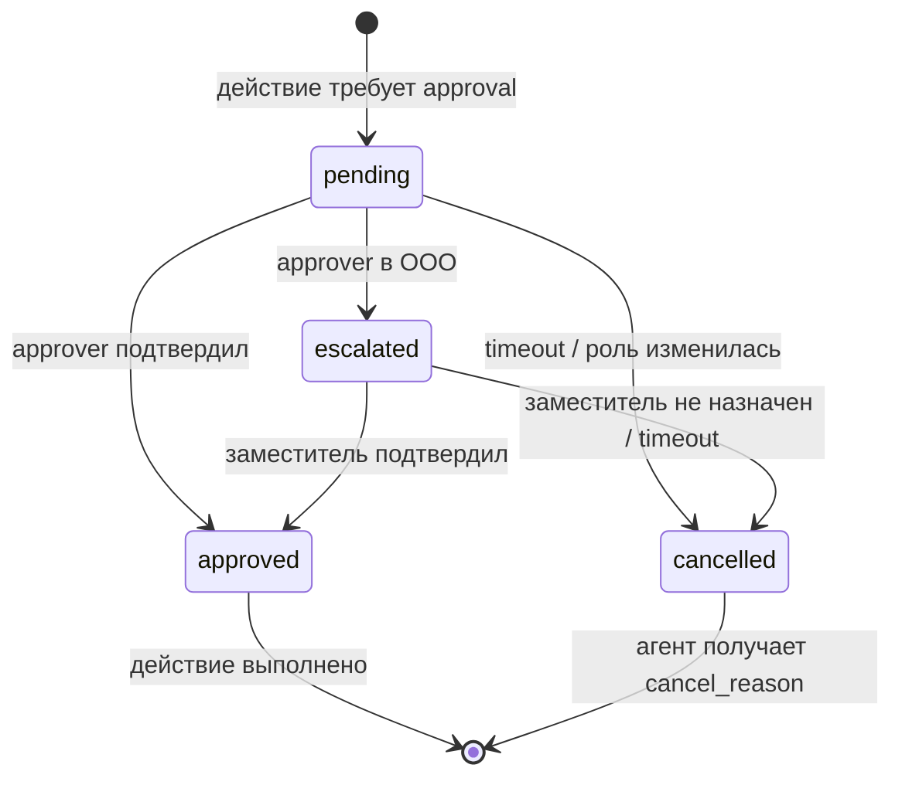
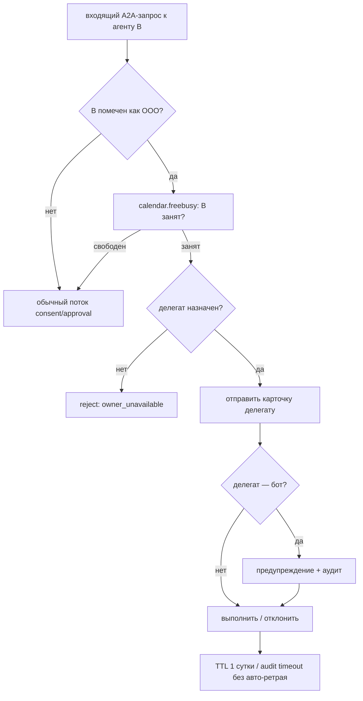
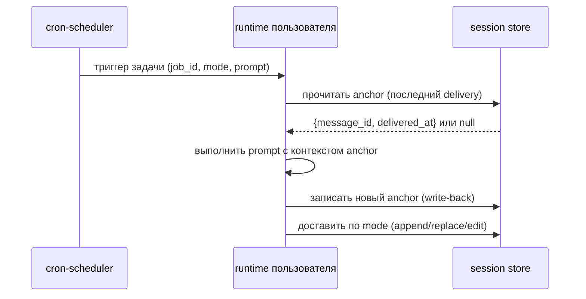

# A2A — межагентное взаимодействие

> **Статус:** частью в разработке. Разделы «Consent», «Approval», «Public
> scope» и «Delegation» — **дизайн-контракты**: поведение зафиксировано,
> реализация в процессе. Cron delivery modes — рабочий механизм (описан как
> есть). Отличие рабочего от замысла отмечено явно.

Агент может получить запрос не от человека, а от другого агента: «ты свободен
сейчас?», «согласуй документ», «уведоми в 9:00». Такие сценарии требуют
собственного governance-слоя поверх обычной безопасности — у агента-отправителя
нет SSO, нет webhook-подписи, нет «личности» в человеческом смысле.

---

## 1. Consent — рукопожатие при первом контакте

**Замысел (дизайн-контракт).**

При первом обращении агента A к агенту B (новый `caller_agent_id`) B не
выполняет запрос, а возвращает consent-карточку получателю-человеку (владельцу
runtime B):

```
[Агент «acct-bot» хочет обращаться к вам]
Тип запросов: status_check
Действует до: 2026-07-01 (TTL 30 дней)
[Разрешить] [Заблокировать]
```

Карточка содержит:

| Поле | Описание |
|---|---|
| `caller_agent_id` | Идентификатор агента-отправителя |
| `caller_display_name` | Человекочитаемое имя (из corp-dir) |
| `requested_scopes` | Список интентов из публичного enum (см. §3) |
| `ttl_days` | Срок действия согласия (≤ 30 дней, затем истекает без авто-продления) |
| `issued_at` | Timestamp |

Правила:
- До подтверждения запрос агента помещается в очередь, не выполняется.
- Блокировка (`block`) создаёт запись в audit-лог и отправляет отправителю
  ответ `403 consent_denied` — без давления, без объяснений от платформы.
- `unblock` снимает блокировку и возвращает к состоянию «ожидает consent».
- TTL истекает тихо — следующий запрос снова инициирует карточку.
- Согласие привязано к паре `(caller_agent_id, scope)`: смена запрашиваемого
  интента требует нового consent.

---

## 2. Approval — согласование по org-policy

**Замысел (дизайн-контракт).**

Некоторые действия агент не выполняет автономно, а ставит на согласование по
ролевой политике компании. Примеры: создание задачи от чужого имени, изменение
статуса сотрудника, отправка уведомления во внешний канал.

### Ролевая политика

```yaml
# Пример конфигурации (обезличенный)
approval_policy:
  - action: "task.create_for_other"
    requires_role: ["manager", "hr"]
    escalation_to: "deputy"      # при OOO approver'а
    timeout_minutes: 60
    on_timeout: "cancel"         # fail-closed
  - action: "notification.external"
    requires_role: ["manager"]
    escalation_to: null
    timeout_minutes: 30
    on_timeout: "cancel"
```

### Edge-cases

| Сценарий | Поведение |
|---|---|
| Approver в OOO | Запрос эскалируется на `escalation_to` (заместитель из corp-dir). Если заместитель не назначен — `cancel`. |
| Approver изменил роль | Если роль больше не соответствует политике, активные запросы на согласование автоматически отменяются (`auto_cancel_on_role_change`). В audit-лог записывается причина. |
| Timeout истёк | Запрос отменяется (`cancel`), не одобряется по молчанию. Fail-closed — принцип по умолчанию. |
| Два одновременных approver'а | Достаточно первого подтверждения; второй видит уведомление «уже согласовано». |
| Approver = отправитель | Политика запрещает самосогласование; запрос эскалируется или отменяется согласно конфигу. |

### Жизненный цикл approval-запроса



---

## 3. Public scope — жёсткий enum публичных интентов

**Рабочий механизм. Enforcement в коде.**

Часть запросов безопасно обрабатывать автоматически, без consent-карточки и
approval. Для этого есть строго ограниченный набор «публичных» интентов.

### Разрешённые интенты

```python
PUBLIC_INTENTS = frozenset({
    "status_check",   # «агент занят?»
})
```

`frozenset` — намеренно. Расширить список нельзя через конфиг или env: только
ревью и изменение кода.

### Контракт ответа на `status_check`

```json
{
  "busy": true,
  "next_slot_iso": "2026-06-17T10:00:00+03:00"
}
```

Ответ содержит **только** `busy: bool` и время следующего свободного слота.
Запрещено возвращать: названия встреч, участников, описания, причины занятости.

Ограничение форсируется в коде:

```python
def handle_status_check(user_id: str) -> dict:
    # calendar.freebusy возвращает только занятые интервалы, без деталей
    busy, next_slot = calendar_freebusy(user_id)
    return {"busy": busy, "next_slot_iso": next_slot.isoformat()}
    # Намеренно: никаких полей помимо этих двух
```

Тест на соблюдение контракта входит в CI:

```python
def test_status_check_response_shape():
    resp = handle_status_check("test-user")
    assert set(resp.keys()) == {"busy", "next_slot_iso"}
```

### Интенты вне enum

Любой интент, не входящий в `PUBLIC_INTENTS`, автоматически маршрутизируется
в consent/approval-поток — даже если это «просто прочитать имя пользователя».

---

## 4. Delegation — переадресация при OOO

**Замысел (дизайн-контракт).**

Если владелец runtime недоступен (командировка, отпуск), входящие A2A-запросы
могут быть переадресованы делегату.

### Алгоритм



### Карточка делегату

```
[Запрос к <B>, который сейчас недоступен]
От: acct-bot (status_check)
Делегировано: системой на основании OOO-статуса
Действует: до 2026-06-18T00:00:00 (TTL 1 сутки)
[Принять и выполнить] [Отклонить]
```

### Правила

- TTL делегирования — **1 сутки**. По истечении запрос попадает в audit-лог
  как `delegation_timeout`; авто-ретрай не производится.
- Если делегат сам является ботом/агентом — запрос выполняется с
  предупреждением и обязательной аудит-записью (`delegated_to_bot: true`).
- После возвращения владельца из OOO активные делегирования отзываются.
- Feedback при блокировке: если делегат отклонил запрос, отправитель получает
  `403 delegated_rejection` без раскрытия причины отклонения.

---

## 5. Известное ограничение — scoped toolset

**Проблема.** При A2A-вызове идеально было бы ограничить toolset агента-
получателя под конкретный запрос: например, при `status_check` агент не должен
иметь права записывать задачи. Текущая база агента (Hermes-Agent) не поддерживает
per-запросный toolset — набор инструментов общий на весь runtime.

**Текущий workaround (слоями):**

1. **Prompt-инструкция** — в system-контексте A2A-запроса явно указывается, что
   агент не должен совершать действия вне запрошенного scope.
2. **Детектор в proxy** — эвристически ловит попытки выйти за рамки публичного
   scope (паттерн на tool-call outside intent).
3. **Предупреждение** — подозрительный вызов подсвечивается в интерфейсе
   владельца runtime.
4. **Аудит** — все tool-call в рамках A2A-сессии логируются с тегом `a2a_session`.

**Полноценное решение** — upstream-фича Hermes-Agent: per-request toolset
(ограниченный набор инструментов для конкретного вызова). До её появления
workaround-слойка снижает, но не устраняет риск.

---

## 6. Cron delivery modes + session anchor

**Рабочий механизм.**

Агент может получать задачи по расписанию (cron): ежедневный дайджест, напоминания,
сводка задач. Проблема без дополнительного слоя: агент не помнит, что отправил по
расписанию — каждый cron-запуск стартует в пустом контексте.

### Режимы доставки

| Режим | Поведение | Когда использовать |
|---|---|---|
| `append` | Добавляет сообщение в текущую сессию (или создаёт новую) | Дайджесты, напоминания — не требуют ответа |
| `replace` | Заменяет последнее сообщение от cron в сессии | Обновляемые сводки (статус проекта) |
| `edit` | Редактирует конкретное сообщение по `message_id` | Точечные правки существующего контента |

### Session write-back (anchor)

После каждой cron-доставки платформа записывает в сессию агента метку:

```json
{
  "event": "cron_delivery",
  "job_id": "daily-digest",
  "mode": "append",
  "message_id": "msg_abc123",
  "delivered_at": "2026-06-16T09:00:00+03:00"
}
```

Эта метка — **session anchor**: при следующем cron-запуске агент видит, что
уже доставлял и когда. Без write-back агент начинает каждый цикл с нуля и,
например, шлёт дайджест дважды.

### Пример конфигурации cron-задач

```yaml
cron_jobs:
  - id: "daily-digest"
    schedule: "0 9 * * 1-5"          # будни в 9:00
    delivery_mode: "append"
    session_anchor: true              # включить write-back
    prompt: "Составь утренний дайджест задач пользователя на сегодня."
    target: "owner"

  - id: "project-status"
    schedule: "0 17 * * 5"           # пятница 17:00
    delivery_mode: "replace"
    session_anchor: true
    prompt: "Обнови еженедельную сводку по активным проектам."
    target: "owner"
```

### Порядок выполнения


