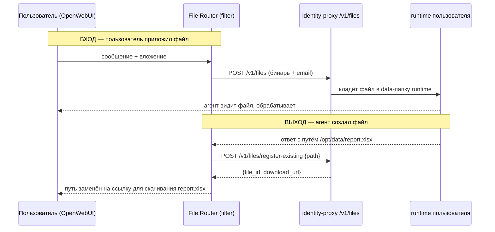

# Файлы: отправка и отображение

Файлы в агентской платформе — отдельный слой, потому что обычный чат-интерфейс
не знает, как передать вложение в **персональный runtime** пользователя и как
показать файл, который агент **создал**. Здесь — два потока и принципы.


## Поток 1. Файлы в чате (загрузка и выдача результата)

Реализуется **функцией-фильтром OpenWebUI** `Corp File Router`
(`services/openwebui/file_router.py`) + файловыми эндпоинтами `identity-proxy`.



- **Вход (inlet):** фильтр читает бинарь вложения прямо из хранилища OpenWebUI и
  форвардит в `POST /v1/files`. proxy кладёт его в data-том персонального
  runtime — файл доступен агенту, не «общему боту».
- **Выход (outlet):** фильтр сканирует ответ агента на абсолютные пути
  (`/opt/data/...`, `/workspace/...`), регистрирует их и **подменяет на
  кликабельные ссылки** для скачивания. Без этого агент «создал отчёт», а
  пользователь видит бесполезный путь.

Контракт `identity-proxy`:
```
POST /v1/files                      (multipart file + email)  -> {id, filename}
POST /v1/files/register-existing    {path, email}             -> {id, download_url}
GET  /v1/files/{id}/content                                    -> бинарь (attachment)
```

## Поток 2. Отправить файл коллеге / наружу

Это НЕ про чат, а про шаринг. Идёт через `files-broker` в **облако самого
пользователя** (Yandex 360 / Google Drive): файл кладётся в его папку, создаётся
публичная ссылка, она и отправляется. См. `files-broker/TOOLS.md` (`make_public_link`).

Почему так, а не хранить у платформы:
- платформа не становится файловой системой (не нужно AV-сканировать, шифровать, retention);
- сотрудник физически видит всё, что отправлял, у себя на диске;
- отзыв доступа — штатными средствами его облака.

## Принципы файлового слоя

1. **Файлы живут у пользователя**, не в общем хранилище платформы: входящие — в
   data-томе его runtime, исходящие наружу — в его облаке.
2. **Изоляция:** runtime одного пользователя не видит файлы другого (разные тома).
3. **Выдача результата — ссылкой, а не путём.** Абсолютный путь в ответе агента
   бесполезен пользователю; фильтр превращает его в скачивание.
4. **Безопасность чтения вложений:** агент читает содержимое файла только когда
   это нужно для задачи — чтобы не жечь токены и не исполнять «хитрые» файлы с
   инструкциями. В A2A вложение получателя не скачивается автоматически.
5. **Секретов в фильтре нет:** URL proxy и ключ задаются вентилями (Valves) в
   админке OpenWebUI.

## Установка фильтра

См. шаг «Фай