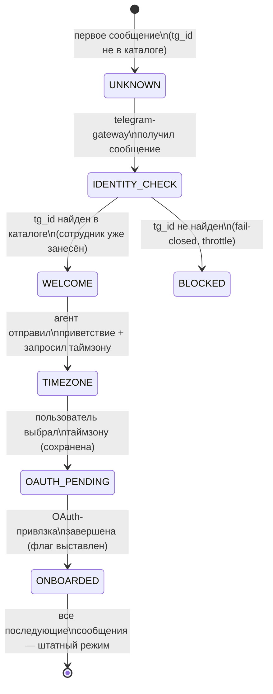
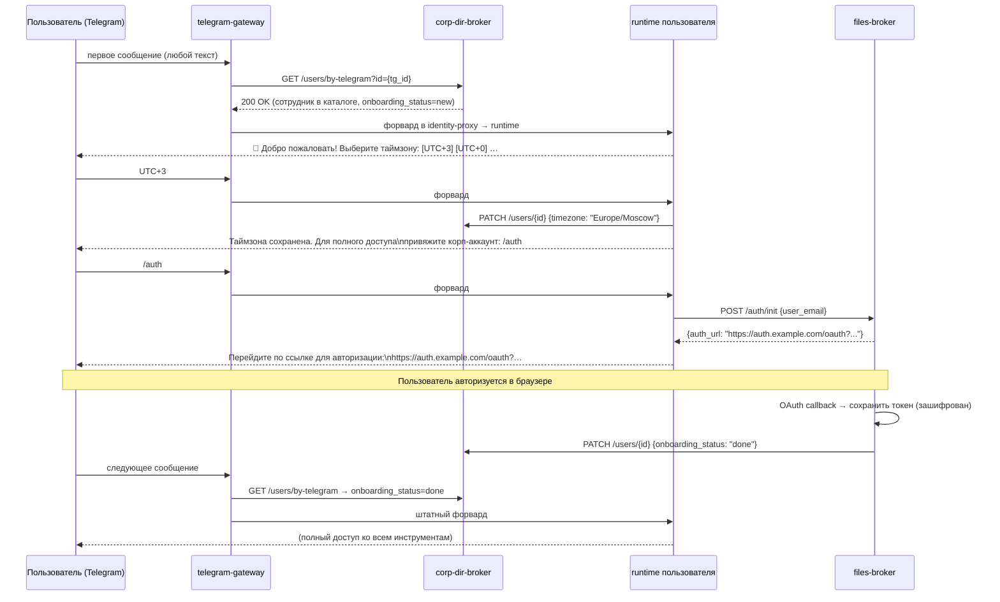

# Онбординг пользователя

Первый контакт нового сотрудника с платформой — особый случай: до того как
пройти онбординг, пользователь не привязан к корпоративному аккаунту, а ряд
инструментов агента (файлы, задачи, почта) требует OAuth-токена. Онбординг
ведёт пользователя за руку от «привет, кто ты?» до «всё готово, работаем».

---

## FSM первого контакта

Онбординг реализуется как конечный автомат (FSM) над состоянием пользователя
в `corp-dir-broker`. Состояние хранится в записи сотрудника (поле
`onboarding_status`).



### Шаги FSM

| Шаг | Триггер | Действие платформы | Хранится |
|---|---|---|---|
| **UNKNOWN → IDENTITY_CHECK** | первое сообщение от нового `tg_id` | резолв через каталог | — |
| **IDENTITY_CHECK → WELCOME** | `tg_id` найден в каталоге | агент отправляет welcome-сообщение, предлагает выбрать таймзону | `onboarding_status = "welcome_sent"` |
| **WELCOME → TIMEZONE** | пользователь ответил таймзоной | таймзона сохранена, агент отправляет инструкцию OAuth-привязки | `timezone`, `onboarding_status = "timezone_set"` |
| **TIMEZONE → OAUTH_PENDING** | таймзона сохранена | агент отправляет ссылку `/auth` для OAuth-привязки корп-аккаунта через files-broker | `onboarding_status = "oauth_pending"` |
| **OAUTH_PENDING → ONBOARDED** | files-broker подтвердил OAuth-callback | агент сообщает «всё готово», флаг онбординга выставлен | `onboarding_status = "done"`, OAuth-токен в files-broker |

---

## Поток онбординга



---

## Паттерн skill-флага

Флаг `onboarding_status = "done"` — пример **skill-флага**: бинарное условие
в записи пользователя, которое открывает/закрывает набор инструментов агента.

Агент при каждом запросе получает skill-флаги пользователя (из corp-dir-broker
или из system prompt, который формирует identity-proxy) и включает/отключает
соответствующие инструменты.

Этот же паттерн применим для других условий: «пользователь прошёл обучение
по безопасности», «одобрен доступ к HR-данным», «подтверждён номер телефона».

---

## Что доступно до и после привязки

| Инструмент | До привязки OAuth | После привязки OAuth |
|---|---|---|
| Текстовый чат с агентом | доступен | доступен |
| Корпоративная память (read-only банк знаний) | доступна | доступна |
| Личная память агента | доступна | доступна |
| Файлы (files-broker): чтение, загрузка | недоступно | доступно |
| Задачи (tasks-broker): просмотр, создание | недоступно | доступно |
| Почта / календарь (если подключены) | недоступно | доступно |
| Поиск по каталогу сотрудников | доступен | доступен |

До завершения онбординга агент информирует пользователя о недоступных
инструментах и предлагает пройти привязку, а не молча возвращает ошибку.

---

## Хранение состояния онбординга

Состояние хранится в записи сотрудника в `corp-dir-broker`. Поля:

```json
{
  "email": "user@corp.example.com",
  "telegram_id": "123456789",
  "telegram_chat_id": "123456789",
  "onboarding_status": "done",
  "timezone": "Europe/Moscow"
}
```

`telegram_chat_id` сохраняется при первом контакте и используется для
проверки chat_id ownership при последующих updates (см.
[TELEGRAM_MUX.md](TELEGRAM_MUX.md)).

OAuth-токен хранится **не** в corp-dir-broker, а в files-broker (зашифрован
at-rest мастер-ключом брокера). corp-dir-broker хранит только флаг
`onboarding_status`.

---

## Ссылки

- Детали Telegram MUX: [TELEGRAM_MUX.md](TELEGRAM_MUX.md)
- Принцип «доступ от имени пользователя»: [PRINCIPLES.md](PRINCIPLES.md) §3
- Принцип «секреты не попадают в runtime»: [PRINCIPLES.md](PRINCIPLES.md) §5
- Заглушка шлюза: [services/telegram-gateway/](../services/telegram-gateway/)
