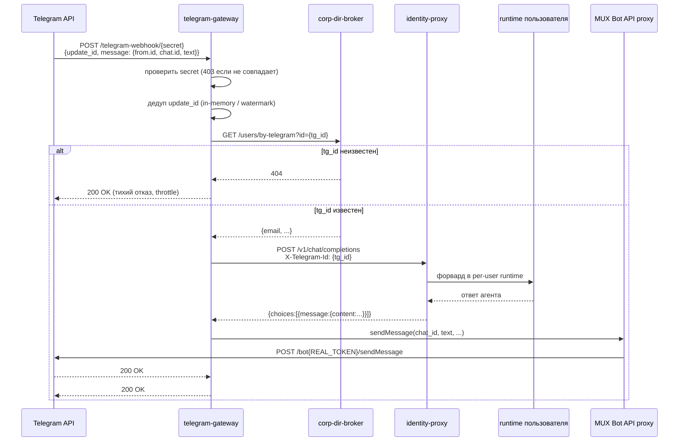

# Telegram MUX — один бот на всех

## Проблема

Базовый Telegram-бот однопользовательский: один `TOKEN`, один webhook, одна
очередь обновлений. В корпоративной платформе пользователей много, и у каждого
— персональный runtime с отдельной памятью. Наивное решение «один бот = один
runtime на всех» ломает изоляцию данных и противоречит принципу
[«контейнер на пользователя»](PRINCIPLES.md).

MUX решает это без заведения отдельного бота на каждого сотрудника.

---

## Решение: fake per-user токен + per-runtime очереди

```
┌─────────────────────────────────────────────────────────────┐
│                  Один Telegram-бот (один TOKEN)             │
│                                                             │
│  Telegram API                                               │
│      │                                                      │
│      ▼ webhook                                              │
│  telegram-gateway                                           │
│      │ резолв tg_id → runtime_id                           │
│      ▼                                                      │
│  identity-proxy                                             │
│      │ per-user runtime                                     │
│      ├──► runtime: alice  ──► MUX passthrough Bot API      │
│      └──► runtime: bob    ──► MUX passthrough Bot API      │
│                                       │                     │
│                                       ▼                     │
│                               Telegram API                  │
│                               sendMessage (один TOKEN)      │
└─────────────────────────────────────────────────────────────┘
```

**Fake per-user токен.** Каждому user-runtime при создании выдаётся
псевдо-токен:

```
fake_token = HMAC-SHA256(runtime_id, MUX_SECRET)
```

`MUX_SECRET` — мастер-секрет, хранится только в env платформы (принцип 5:
[секреты платформы не попадают в runtime](PRINCIPLES.md)). Runtime «думает»,
что у него настоящий токен, и вызывает Bot API через него. MUX-прокси Bot API
верифицирует HMAC, подставляет реальный токен и форвардит запрос к Telegram.

**Per-runtime очереди.** MUX ведёт отдельную очередь входящих updates для
каждого runtime: update попадает в очередь нужного пользователя по `tg_id`,
runtime читает только свою очередь — изоляция сохраняется.

**Глобальные методы.** `setWebhook` и `getMe` перехватываются MUX-прокси:
- `setWebhook` от runtime → игнорируется или сохраняется как callback-адрес
  runtime, реальный webhook уже настроен на MUX;
- `getMe` → возвращает данные реального бота.

Все остальные методы (`sendMessage`, `sendChatAction`, `setMessageReaction`,
`getFile`, …) — passthrough с подстановкой реального токена.

---

## Поток входящего сообщения



---

## Webhook-аутентификация

### Секрет в пути URL

Webhook регистрируется с секретом в пути:

```
https://your-domain.example.com/telegram-webhook/<TELEGRAM_WEBHOOK_SECRET>
```

`TELEGRAM_WEBHOOK_SECRET` — случайная строка (min 32 символа), хранится
в `.env`. При получении запроса gateway сравнивает secret из пути с env
через `hmac.compare_digest` (constant-time — защита от timing-атак).

Преимущество перед заголовком `X-Telegram-Bot-Api-Secret-Token`: секрет
не попадает в `access.log` reverse-proxy по умолчанию (если log_format не
включает тело запроса) и не зависит от того, как proxy пробрасывает заголовки.

### chat_id ownership

При резолве нужно убедиться, что `chat_id` в update совпадает с `chat_id`,
зарегистрированным за этим `tg_id` в каталоге. Это предотвращает спуфинг:
злоумышленник не может подставить чужой `chat_id` в сообщение.

Схема: при онбординге (первый контакт) `chat_id` сотрудника сохраняется в
`corp-dir-broker`; при каждом update — сравниваем.

### Fail-closed для неизвестных tg_id

Если `tg_id` не найден в каталоге — gateway возвращает Telegram `200 OK`
(чтобы остановить повторные попытки), но **не отвечает пользователю** и
**не форвардит** в proxy. После N попыток с одного неизвестного `tg_id` —
temporary throttle.

Не возвращать информативную ошибку в Telegram: это позволило бы перебором
определять, кто зарегистрирован.

### Дедупликация по update_id (watermark)

Telegram гарантирует монотонно возрастающий `update_id`. При рестарте
gateway повторно доставляет накопившиеся updates — без дедупа агент получит
дубликаты.

Схема persistent watermark:
```
last_seen_update_id (int) → персистентный store (Redis / БД)
При каждом update: если update_id <= last_seen → пропустить.
После обработки: last_seen_update_id = update_id.
```

В заглушке — in-memory set. Достаточно для разработки, в проде нужен
persistent store (иначе рестарт = дубли).

---

## UX генерации ответа

### Typing-индикатор

Пока агент думает, пользователь видит «печатает…» в Telegram. Реализуется
циклическим `sendChatAction(chat_id, "typing")` — действует 5 секунд,
нужно повторять. Останавливается по завершении генерации.

```python
# Псевдокод typing-loop
async def typing_loop(chat_id, bot_token, stop_event):
    while not stop_event.is_set():
        await send_chat_action(chat_id, "typing", bot_token)
        await asyncio.sleep(4)
```

### Реакции

На входящее сообщение — реакция (например 🤔) через `setMessageReaction`:
сигнализирует, что сообщение принято. По завершении генерации — снять реакцию.

```python
# TODO: setMessageReaction(chat_id, message_id, reaction=[{"type":"emoji","emoji":"🤔"}])
```

### Чанкинг

Telegram ограничивает сообщение 4096 символами. Ответ агента разбивается на
чанки по 4096:

```python
chunks = [text[i:i + 4096] for i in range(0, len(text), 4096)]
for chunk in chunks:
    await send_message(chat_id, chunk, parse_mode="Markdown")
```

Разбивать лучше по абзацам/предложениям, а не по байту — иначе можно разрезать
Markdown-разметку. В проде: попробовать `parse_mode="Markdown"`, при ошибке
форматирования — отправить plain text.

---

## Голос: входящий (STT) и исходящий (TTS)

### STT — входящий voice

Telegram отправляет голосовые как `voice` (формат `.oga` / Opus). Поток:

```
Telegram voice update
    │
    ▼
getFile → скачать .oga файл
    │
    ▼
STT-провайдер:
    • локально: faster-whisper (не уходит в облако)
    • внешний: Whisper API / аналог
    │
    ▼
транскрипт (текст) + путь к оригинальному файлу
    │
    ▼
агент (в content: транскрипт; в metadata: путь к файлу)
```

Транскрипт передаётся агенту как обычный текст. Путь к исходному `.oga`
передаётся в метаданных — агент может сослаться на него, если нужно.

### TTS — исходящий (опционально)

Опциональный этап: ответ агента → синтез речи → отправить как `voice` обратно.
Имеет смысл только для «разговорных» сценариев. По умолчанию — не используется.

---

## Добавление канала (реестр платформ)

Telegram — один из каналов. Платформа спроектирована так, что добавление
нового канала (Microsoft Teams, IRC, Slack, E-mail) не требует правки ядра
(identity-proxy, provisioner, брокеры).

**Принцип расширяемости:** каждый канал — отдельный **plugin-адаптер**:

```
┌──────────────────────────────────────────────────┐
│            Реестр каналов-адаптеров              │
│                                                  │
│  telegram-gateway  (этот сервис)                 │
│  teams-gateway     (пример расширения)           │
│  irc-gateway       (пример расширения)           │
│         │                                        │
│         ▼ общий контракт                         │
│  identity-proxy   POST /v1/chat/completions      │
│                   X-Telegram-Id / X-User-Email   │
└──────────────────────────────────────────────────┘
```

Контракт адаптера:
1. Принять сообщение из своего канала.
2. Аутентифицировать источник (по механизму канала).
3. Резолвить идентификатор пользователя в корпоративный email через
   `corp-dir-broker`.
4. Отправить POST `/v1/chat/completions` в `identity-proxy` с заголовком,
   идентифицирующим пользователя.
5. Отправить ответ агента обратно в канал.

**Microsoft Teams (пример).** Teams шлёт Activity-события через Bot Framework
webhook. Адаптер верифицирует JWT-токен Teams, резолвит UPN (user@corp.example.com)
напрямую как email (если домен совпадает с корпоративным), форвардит в proxy.

**IRC (пример).** IRC-бот подключается к серверу, слушает PRIVMSG. При
получении команды — резолвит nick → email через `corp-dir-broker` (добавить
поле `irc_nick` в каталог), форвардит в proxy, отправляет ответ PRIVMSG-ом.

Оба примера работают без единой правки `identity-proxy` или `provisioner`.

---

## Таблица переменных окружения

| Переменная | Компонент | Описание |
|---|---|---|
| `TELEGRAM_WEBHOOK_SECRET` | telegram-gateway | Секрет пути webhook. Обязательно. |
| `TELEGRAM_BOT_TOKEN` | telegram-gateway / MUX | Настоящий токен бота (не попадает в runtime). |
| `MUX_SECRET` | MUX Bot API proxy | Мастер-секрет для HMAC per-user fake-токенов. |
| `CORP_DIR_URL` | telegram-gateway | URL corp-dir-broker внутри сети. |
| `PROXY_URL` | telegram-gateway | URL identity-proxy. |
| `BROKER_INTERNAL_AUTH` | все сервисы | Общий секрет для межсервисной авторизации. |

---

## Ссылки

- Заглушка шлюза: [services/telegram-gateway/](../services/telegram-gateway/)
- Принципы изоляции: [PRINCIPLES.md](PRINCIPLES.md)
- Онбординг (первый контакт): [ONBOARDING.md](ONBOARDING.md)
- Общая архитектура: [ARCHITECTURE.md](ARCHITECTURE.md)
