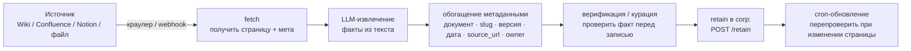

# Ingestion — наполнение корпоративной памяти

Корп-банк `corp:<org>` не наполняется сам. Нужен конвейер: страницы базы знаний
→ LLM-извлечение фактов → метаданные → запись в банк → cron-обновление.
Агент читает из банка со ссылкой на источник; писать в него не может.

---

## 1. Схема конвейера



### Этапы

| Этап | Что происходит |
|---|---|
| **fetch** | Краулер обходит страницы по API источника (или получает webhook при изменении). Отдаёт сырой текст + метаданные страницы. |
| **LLM-извлечение** | LLM разбивает текст на атомарные факты. Каждый факт — одно утверждение, максимально самостоятельное. |
| **обогащение** | К каждому факту прикрепляются метаданные (см. §2). |
| **верификация** | Опциональная ручная курация перед записью в банк. Автоматическая проверка: дубли, ссылки-заглушки, устаревшие версии. |
| **retain** | Запись в corp-банк через `POST /retain`. Банк отклоняет retain, если запрос пришёл из user-runtime (двойной read-only, см. §4). |
| **cron-обновление** | По расписанию краулер проверяет изменённые страницы (по `last_modified`). Устаревшие факты помечаются; новая версия добавляется с новой датой. |

---

## 2. Минимальный формат метаданных факта

Каждый факт в банке хранится вместе с метаданными. Минимальный набор:

```json
{
  "fact_id":    "fact_01j...",
  "text":       "Регламент согласования договоров: срок ответа — 3 рабочих дня.",
  "bank":       "corp:myorg",
  "source": {
    "document":   "Регламент договорной работы",
    "slug":       "dogovorny-reglament",
    "version":    "2.4",
    "date":       "2026-05-10",
    "source_url": "https://wiki.example.com/pages/dogovorny-reglament",
    "owner":      "legal-team"
  },
  "ingested_at": "2026-06-16T08:00:00Z",
  "superseded":  false,
  "superseded_by": null
}
```

| Поле | Обязательно | Описание |
|---|---|---|
| `fact_id` | да | Уникальный идентификатор факта (ULID) |
| `text` | да | Текст факта (атомарное утверждение) |
| `bank` | да | Имя банка: `corp:<org>` |
| `source.document` | да | Название исходного документа |
| `source.slug` | да | Машиночитаемый slug документа |
| `source.version` | рекомендуется | Версия или ревизия документа |
| `source.date` | да | Дата документа / последнего изменения |
| `source.source_url` | да | Прямая ссылка на страницу |
| `source.owner` | рекомендуется | Команда / подразделение-ответственный |
| `ingested_at` | да | Когда был записан факт |
| `superseded` | да | Устарел ли факт (при обновлении документа) |
| `superseded_by` | нет | `fact_id` новой версии (если устарел) |

### Правило цитирования

Агент **обязан** включать в ответ `source.source_url` и `source.date`.
Пересказ «по памяти» без ссылки недопустим. Это не пожелание — это
инвариант системы.

---

## 3. Пример: recall-ответ агента

При recall из corp-банка агент получает:

```json
{
  "facts": [
    {
      "text": "Регламент согласования договоров: срок ответа — 3 рабочих дня.",
      "source_url": "https://wiki.example.com/pages/dogovorny-reglament",
      "date": "2026-05-10",
      "document": "Регламент договорной работы",
      "version": "2.4"
    }
  ]
}
```

Агент цитирует:

> Срок согласования договора — 3 рабочих дня
> ([Регламент договорной работы v2.4, 10 мая 2026](https://wiki.example.com/pages/dogovorny-reglament))

---

## 4. Двойной read-only — как форсируется

Корп-банк защищён от случайной записи из агентов на двух уровнях независимо:

### Уровень 1 — серверный (провайдер памяти)

Банк `corp:<org>` на стороне провайдера настроен как read-only для всех
токенов, кроме ingestion-сервисного токена:

```
# Пример: политика банка на стороне провайдера
bank: corp:myorg
  allow_retain: [service-token-ingestion]
  allow_recall: [service-token-runtime, service-token-ingestion]
```

Если runtime-токен пытается вызвать `POST /retain` на корп-банк — провайдер
возвращает `403 read_only_bank`.

### Уровень 2 — клиентский (конфиг агента)

В конфигурации agenta / tools-политике corp-банк присутствует **только в
`tools.include: [recall]`**. Инструмент `retain` для corp-банка агенту
не показан:

```yaml
memory:
  banks:
    - name: "corp:myorg"
      tools:
        include: ["recall"]   # только чтение
        # retain намеренно отсутствует
    - name: "user:__current__"
      tools:
        include: ["recall", "retain"]
```

Два независимых слоя: если один обходится — второй держит.

---

## 5. Пример cron-задачи обновления

```yaml
# В конфигурации ingestion-сервиса (обезличенный образец)
ingestion_jobs:
  - id: "wiki-full-sync"
    source: "confluence"
    base_url: "https://wiki.example.com"
    space_key: "CORP"
    bank: "corp:myorg"
    schedule: "0 3 * * *"       # ежедневно в 3:00
    mode: "incremental"          # только изменившиеся страницы
    llm_extraction: true
    verify_before_retain: false  # автоматически, без ручной курации

  - id: "hr-policies-sync"
    source: "confluence"
    base_url: "https://wiki.example.com"
    space_key: "HR"
    bank: "corp:myorg"
    schedule: "0 4 * * 1"       # по понедельникам в 4:00
    mode: "full"                 # полный пересмотр
    llm_extraction: true
    verify_before_retain: true   # ручная курация перед записью
```

---

## 6. Инструкция для LLM-ассистента (паста)

Скопируйте в чат, заполнив `<…>`.

---

Ты настраиваешь **конвейер наполнения корп-памяти** для агентской платформы.

### Мой источник знаний
- Тип: `<Confluence | Notion | MediaWiki | файловая папка | ...>`
- URL / путь: `<...>`
- Токен доступа: `<env: INGESTION_SOURCE_TOKEN>`

### Провайдер памяти
- Адрес (внутренняя сеть): `<http://memory:PORT>`
- Ingestion-токен: `<env: MEMORY_INGESTION_TOKEN>`
- Банк: `corp:<myorg>`

### Сделай
1. Краулер: обход страниц по API источника + delta-sync по `last_modified`.
2. LLM-экстрактор: разбивка текста на атомарные факты.
3. Обогащение метаданными: документ, slug, version, date, source_url, owner.
4. `POST /retain` на corp-банк (ingestion-токен).
5. Пометка устаревших фактов при обновлении страницы (`superseded: true`).
6. Cron-конфигурация (ежедневный incremental + еженедельный full).
7. Список env: `INGESTION_SOURCE_TOKEN`, `MEMORY_INGESTION_TOKEN`, `MEMORY_CORP_BANK`.

### Инварианты
- Банк corp — только для ingestion-сервиса; runtime-токен не может retain.
- Каждый факт несёт `source_url` и `date` — агент цитирует их в ответе.
- Транспорт до провайдера памяти — приватный (VPN/mesh), не публичный интернет.
